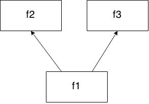

Say you have these dependencies:



i.e. you must fetch the `f2` and `f3` data before fetching the `f1` data. However `f2` and `f3` can be fetched in parallel.

`fetch-optimizer` take care of your fetchers running them
in parallel when possible.

```js
// fetchers.js

import { Poset, optimize } from 'fetch-optimizer';

// define the fetchers. A fetcher must have the following signature:
// () => Promise
const fetchers = {
  f1: () => new Promise(resolve => setTimeout(resolve('f1'), 200)),
  f2: () => new Promise(resolve => setTimeout(resolve('f2'), 50)),
  f2: () => new Promise(resolve => setTimeout(resolve('f3'), 150))
};

// define the dependencies between the fetchers
const dependencies = new Poset()
  .addEdge('f1', 'f2')  // f1 requires f2
  .addEdge('f1', 'f3'); // f1 requires also f3

optimize(dependencies, fetchers).then(() => {
    // tasks completed...
});
```

Run:

```sh
DEBUG=fetch-optimizer node fetchers.js
```

Console output:

```sh
fetch-optimizer the following fetchers will run in parallel: ["f2","f3"] with input: null +0ms
fetch-optimizer fetcher `f2` returns: "f2" +53ms
fetch-optimizer fetcher `f3` returns: "f3" +100ms
fetch-optimizer the following fetchers will run in parallel: ["f1"] with input: ["f2","f3"] +0ms
fetch-optimizer fetcher `f1` returns: "f1" +202ms
```
